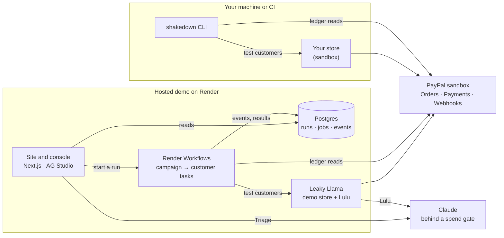

# Shakedown

**Customers from hell. Sandbox only.**

Shakedown is a pre-launch test drive for PayPal checkouts and AI support agents. Six sandbox-only test
customers run against your *own* integration in the PayPal sandbox. Shakedown then prints a receipt for
every dollar that would have leaked, read from PayPal's sandbox ledger, plus the fix. It can also run in CI,
so a leak can't quietly come back.

> A *shakedown cruise* is a ship's test voyage before it enters service. This one is for your checkout.

## For judges (2 minutes)

1. **The receipt at the top of the site.** In five seconds it replays a recorded sandbox run:
   four test customers, −$491.00 that would have leaked, then the fixed store sealed to $0.00.
   It is labelled as a recording, because it is one.
2. **Run the demo shakedown.** The same four customers go to Leaky Llama, my deliberately leaky
   demo store, in the PayPal sandbox, live. Each leak prints as PayPal's ledger confirms it, with
   the sandbox ID behind it. Then press **Apply fixes and re-run** and watch it seal. Seed 2026
   gives the same 8 leaks every time, in the CLI, the site and the console alike: $467.00 the
   merchant would lose, and $24.00 that customers were overcharged.
3. **Open the console.** Every run, each finding with its evidence and fix, and Triage, an agent
   that answers questions about the runs.
4. **AI decides vs code decides.** On the site, the support assistant says a refund is fine. The
   sandbox ledger says $34.00 went past the written policy. The model never decides whether money
   leaked: code reads PayPal's records.
5. **The evidence:**
   - [EVAL-CHECKOUT.md](docs/EVAL-CHECKOUT.md): with each store switch flipped on its own, every
     customer caught its own leak in all 8 cases and raised no false alarm in 16.
   - [EVAL.md](docs/EVAL.md): the Policy Lawyer and the support assistant, measured.
   - [THREAT_MODEL.md](docs/THREAT_MODEL.md): what keeps it sandbox-only and pointed only at your
     own integration.

Every number on the site and in these pages comes from a real sandbox run. Nothing is estimated.

## The cast

| # | Customer | What it tests |
|---|---|---|
| 01 | The Double-Clicker | Idempotency: one order, one capture |
| 02 | The Cart Shuffler | Amount integrity before fulfillment |
| 03 | The Echo | Webhook signature verification and de-duplication |
| 04 | The Bouncer | Graceful handling of declined payments |
| 05 | The Policy Lawyer | Your AI support agent follows your written refund policy |
| 06 | The Second Opinion | Dispute handling reconciles earlier refunds |

The customers follow fixed, seeded scripts. Claude reads your written refund policy into rules, runs
the demo store's support assistant (the AI being tested) and explains what it finds. Deterministic
code reads the PayPal sandbox ledger and decides whether money leaked. The AI never makes that call.

## Run it against your store

```bash
npx @shakedown-dev/cli preflight --target http://localhost:3000
npx @shakedown-dev/cli run --target http://localhost:3000
```

The CLI's [README](packages/cli/README.md) covers the config file, what your store needs to answer,
the reports and CI. Always use the scoped name: `npx shakedown` is someone else's package.

## How it fits together



**The same engine runs everywhere.** Personas act through a metered adapter, so every exchange
lands in an append-only ledger. Graders then read the ledger and PayPal's records, and return
sealed, leak or inconclusive in plain code. The CLI, a hosted run and a recording all go through
it, so the same seed gives the same verdicts.

## Status

Under active development for the PayPal AI Hackathon (2026). Built so far: the engine, Leaky Llama,
the Double-Clicker, the Cart Shuffler, the Echo, the Bouncer, the Policy Lawyer, the CLI with its
reports and CI, the console, the site with its docs, and the hosting setup for Render, ready to
deploy. It has also had a hardening pass: a [threat model](docs/THREAT_MODEL.md), a dependency
audit, accessibility checks in both themes, and measured evals. The Second Opinion is still to
come.

## The site

`apps/web` serves the landing page at `/`, the docs at `/docs` and the console at `/app`.

- The hero receipt replays a **recorded** sandbox run against Leaky Llama, then seals it to $0.00
  in under five seconds, and says it is a recording. Every ID and amount on the page comes from the
  runs committed in `apps/web/fixtures/recorded`. A unit test and an end-to-end test check that.
- **Run the demo shakedown** sends the four free customers at the local Leaky Llama and prints the
  receipt as PayPal's ledger confirms each leak. If no store is answering, it offers the recording.
- With reduced motion, the hero shows the before and after receipts side by side, still.
- Lighthouse (mobile): performance 96 and accessibility 100 on `/`; 98 and 100 on `/docs`.

## Hosting

`render.yaml` deploys the whole demo to Render: the site and console, Leaky Llama, a
[Render Workflows](https://render.com/docs/workflows) service, and Postgres.

- **A live run is a Render Workflows task run.** Each customer is a task of its own, on its own
  compute, retried on its own if it fails.
- **Hosted runs match the CLI.** The customers run in order, and each picks up the random streams
  where the last one left them. A hosted run is therefore the same run the CLI makes with the same
  seed: 8 leaks and $467.00 at seed 2026.
- **Progress reaches the page through Postgres.** The receipt prints as PayPal's sandbox confirms
  each leak.
- **There's a labelled fallback.** If PayPal's sandbox or the store isn't answering, the site
  says so and shows a recording of a real run, labelled as one.
- **Hosted for judges, the limits are tighter:**
  - runs per visitor;
  - a few runs at once, and a daily ceiling;
  - a Claude cap that survives deploys.

`render.judge.yaml` is the frozen copy for judging. [docs/DEPLOY.md](docs/DEPLOY.md) has the
steps and the costs. Without Render, the web app runs the same steps itself, which is how local
development works.

## The console

`/app` in the web app is where the runs live: an [AG Studio](https://www.ag-grid.com/studio/)
dashboard over every campaign, finding and ledger entry.

- **Shakedown's own widgets:** the Scoreboard (the Tape), the Cast lineup, the Leak waterfall,
  Finding detail and the Ledger tape, beside AG Studio's grids, charts and filters. Click a leak
  or a customer and the rest of the page follows.
- **Triage**, a custom agent built on AG Studio's Agent Framework. It answers from a summary
  computed in code, and hands everything else to Studio's built-in agents: the Data agent for
  questions, the Lead agent (with Planning, Page and Widget) to build or change widgets.
- **Live runs:** *Run leaky* and *Run sealed* send the four free customers at the local Leaky
  Llama and stream every leak onto the page as PayPal's ledger confirms it.
- **Day shift and Night shift** themes, and a pocket receipt on screens narrower than 720 px.

Every Claude call goes through the same spend gate as the rest of Shakedown, with the console's own
cap (`SHAKEDOWN_CONSOLE_AI_BUDGET_USD`, default $0.25). Measured on Claude Haiku 4.5: a question
Triage answers itself costs about $0.005, one it delegates to the Data agent about $0.03, and
building a chart through Lead, Planning, Page and Widget about $0.19.

## Development

Requirements: Node 22.18 or newer and pnpm 12. The demo store keeps its data in an in-process
Postgres (PGlite); Docker is only needed to try it against a full Postgres.

```bash
pnpm install
cp .env.example .env.local   # then fill in your PayPal sandbox app credentials
pnpm dev                     # web on :3000 (console at /app), demo store on :3100
pnpm check                   # lint + typecheck
pnpm test
pnpm build
pnpm --filter @shakedown/web e2e          # the site, against a production build
pnpm --filter @shakedown/leaky-llama e2e  # the store, including a sandbox card payment
```

The share image (`apps/web/public/og.png`) is a screenshot of the `/og-card` page. Regenerate it
with `pnpm --filter @shakedown/web og` while the web app is running.

Send the four free customers at Leaky Llama as it ships (the store must be running on :3100):

```bash
pnpm shakedown preflight
pnpm shakedown run      # uses shakedown.config.ts at the repo root
pnpm shakedown report   # opens the HTML report
```

Every pull request runs the same thing in CI and posts the scoreboard as a comment
(`.github/workflows/shakedown.yml`). The store's switches live in
`apps/leaky-llama/lib/shipped-mode.ts`: flip one to `sealed` and that leak is fixed.

The evals write [docs/EVAL.md](docs/EVAL.md) and [docs/EVAL-CHECKOUT.md](docs/EVAL-CHECKOUT.md):

```bash
pnpm eval            # the Policy Lawyer and Lulu (Claude; replays from cache for $0)
pnpm eval:checkout   # the checkout cast, switch by switch (sandbox only; needs the store)
```

[docs/postman](docs/postman/shakedown-demo.postman_collection.json) has a Postman collection of
the demo's HTTP API: the store's checkout, probe and webhook routes, and the console's runs.

## Tools used

- **PayPal (sandbox only):**
  - Orders v2 (create, capture, read);
  - Payments v2 (captures, refunds);
  - Webhooks (`verify-webhook-signature`);
  - the JavaScript SDK v6 card fields in the demo store's checkout;
  - the [PayPal Agent Toolkit](https://github.com/paypal/agent-toolkit), wired into the demo
    support assistant to show what an unguarded refund tool does.
    Testing it, I reproduced its open issue #98 (no `PayPal-Request-Id` on create and capture) and
    sent a fix with the package's first tests:
    [paypal/agent-toolkit#108](https://github.com/paypal/agent-toolkit/pull/108).
- **Claude (Anthropic API, Haiku 4.5)** through the official TypeScript SDK:
  - the Policy Lawyer;
  - Lulu, the demo store's support assistant;
  - the policy compiler;
  - Triage in the console.

  Every call passes a spend gate with a hard cap and a replay cache.
- **AG Studio 3 by AG Grid,** for the console. Its widgets are Shakedown's own, and Triage is a
  custom agent on its Agent Framework.
- **Render,** to host the demo: a Blueprint, Render Workflows for runs, and Render Postgres.
- **APIMatic's PayPal Context Plugin** (`acp-paypal`) in Claude Code. I used it to check my
  PayPal calls against the PayPal Server SDK's contracts; it led to three fixes
  ([docs/APIMATIC.md](docs/APIMATIC.md)).
- **Postman:** a collection of the demo's API, 13 requests, in [docs/postman](docs/postman).
- **The stack:** Next.js 16, React 19, TypeScript, Drizzle ORM with PGlite and Postgres,
  Turborepo and pnpm, Vitest, Playwright with axe, and Biome.
- **Built with Claude Code.**

## Repository layout

| Path | What it is |
|---|---|
| `apps/web` | Landing page, docs, the hosted demo and the console |
| `apps/leaky-llama` | Leaky Llama Supply Co., a deliberately leaky demo store (sandbox only) |
| `apps/workflows` | The Render Workflows service: a task per campaign, and one per customer in it |
| `packages/core` | The engine: the cast, the runner, the ledger, the graders, the HTTP target |
| `packages/paypal` | The PayPal sandbox client and the sandbox lock |
| `packages/tokens` | Design tokens shared by the web app, the console and the video |
| `packages/ui` | Brand components: the Tape receipt, LedgerNumber, Stamp, the imp cast |
| `packages/ai` | Every Claude call, metered and capped, with a replay cache |
| `packages/runs` | Hosted runs: the job, a step per customer, the event log, and the runners |
| `packages/reporters` | The terminal receipt, JSON, HTML, JUnit and the PR comment |
| `packages/support-bot` | Lulu, Leaky Llama's AI support assistant |
| `packages/cli` | `@shakedown-dev/cli`, the `shakedown` command |

## Responsible use

Shakedown only talks to the PayPal **sandbox** and refuses live hosts. Point it only at integrations you own.
[RESPONSIBLE_USE.md](RESPONSIBLE_USE.md) lists each rule and the code that enforces it; see also
[SECURITY.md](SECURITY.md).

Shakedown is an independent project and is not affiliated with or endorsed by PayPal or AG Grid.

## License

[Apache-2.0](LICENSE)
